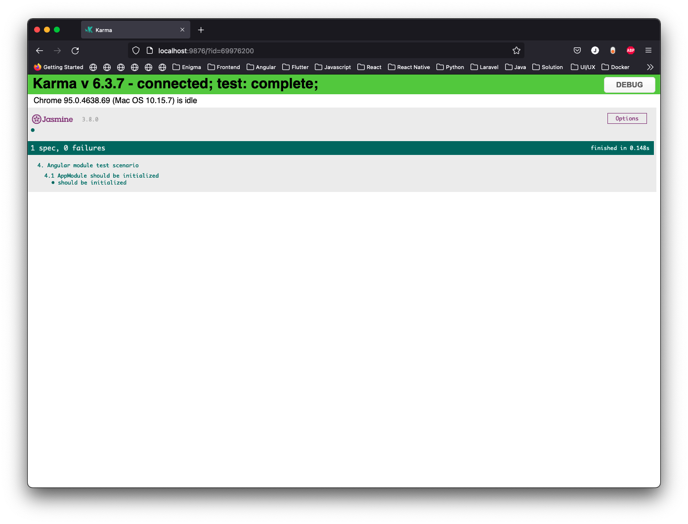
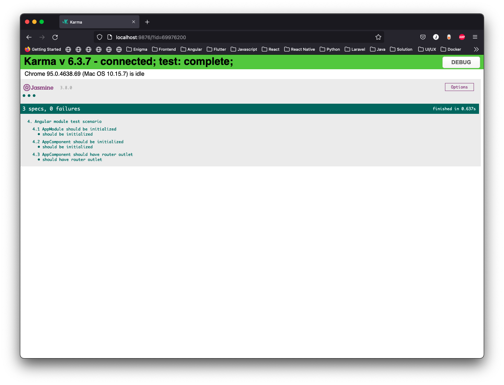
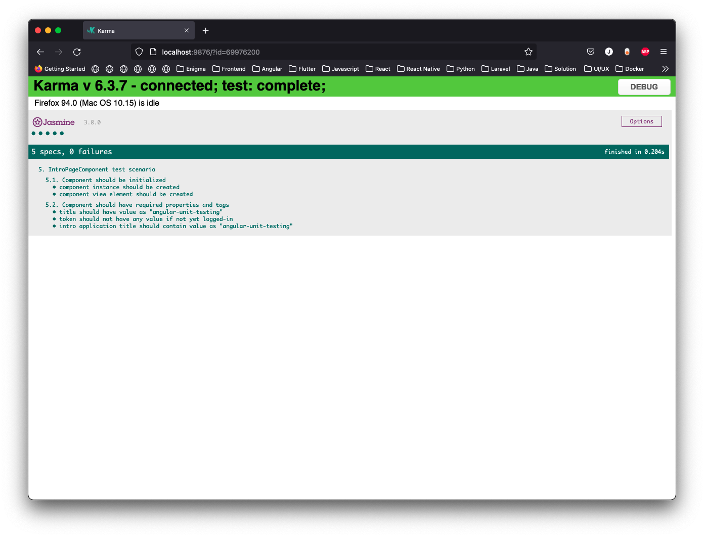
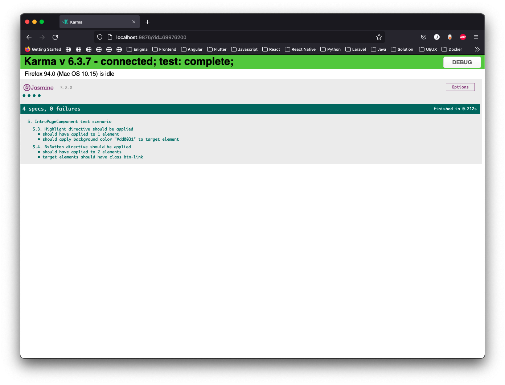
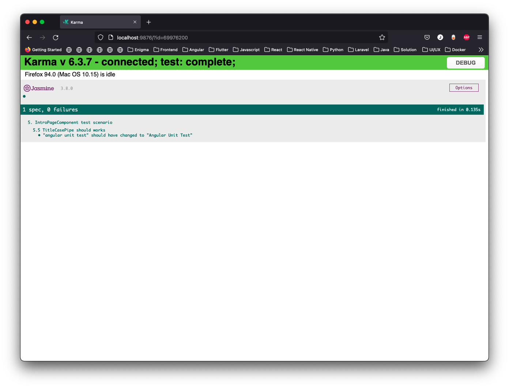

# Angular Unit Testing - Part 1

## Sebelum Memulai

Buka file `src/test.ts` yang sudah kita ubah `context` path dari `./test` menjadi `./`, agar unit testing dapat mencakup module, component, view, hingga service Angular.

```typescript
// This file is required by karma.conf.js and loads recursively all the .spec and framework files

import 'zone.js/testing';
import { getTestBed } from '@angular/core/testing';
import {
  BrowserDynamicTestingModule,
  platformBrowserDynamicTesting
} from '@angular/platform-browser-dynamic/testing';

declare const require: {
  context(path: string, deep?: boolean, filter?: RegExp): {
    keys(): string[];
    <T>(id: string): T;
  };
};

// First, initialize the Angular testing environment.
getTestBed().initTestEnvironment(
  BrowserDynamicTestingModule,
  platformBrowserDynamicTesting(),
  { teardown: { destroyAfterEach: true }},
);

// Sesuaikan code di bawah ini, ./test menjadi ./
const context = require.context('./', true, /\.spec\.ts$/);

// And load the modules.
context.keys().map(context);
```

## Materi

### 1. Unit Testing Angular `module`

Pengujian Angular module ditujukan untuk memastikan bahwa module berhasil dibuat.
Pengujian untuk module ini biasanya tidak begitu diperlukan, kecuali ada logic tertentu yang diimplementasikan ke dalam class module.
Pada contoh kali ini, pengujian module hanya akan menguji apakah module tersebut berhasil dibuat.


Mulailah dengan membuat file `src/app/app.module.spec.ts`, dan tulislah kode berikut.

```typescript
import { TestBed } from '@angular/core/testing';
import { AppModule } from './app.module';

describe('4. Angular module test scenario', () => {

  beforeAll(() => {
    TestBed.configureTestingModule({
      imports: [ AppModule ]
    });
  });

  it('AppModule should be initialized', () => {
    const module: AppModule = TestBed.inject(AppModule);

    expect(module).toBeTruthy();
    expect(module).toBeInstanceOf(AppModule);
  });
});
```

#### Penjelasan

1. `beforeAll` merupakan salah satu fungsi dari library jasmine yang akan dijalankan sebelum seluruh test case berjalan.
2. `TestBed` merupakan wadah di mana aplikasi angular akan berjalan untuk diuji.
3. `TestBed.configureTestingModule()` merupakan fungsi untuk mengkonfigurasi dependencies yang dibutuhkan selama proses unit testing.
4. `TestBed.inject()` merupakan fungsi untuk meng-inject suatu class yang akan diuji menjadi sebuah instance yang dapat digunakan.



### 2. Unit Testing Angular `component`

Pengujian component diperlukan untuk memastikan suatu angular component berjalan sesuai ekspektasi. Pada bagian ini kita akan melanjutkan pengujian untuk `AppComponent`. Masih di file `src/app/app.module.spec.ts`, tambahkan kode berikut.

```typescript
import { TestBed } from '@angular/core/testing';
import { AppModule } from './app.module';

describe('4. Angular module test scenario', () => {
  
  let fixture: ComponentFixture<AppComponent>;
  
  beforeAll(() => {
    TestBed.configureTestingModule({
      imports: [ AppModule ]
    });

    fixture = TestBed.createComponent(AppComponent);
  });
  
  /** bagian yang tidak berubah, tidak ditampilkan. */
  it('AppModule should be initialized', () => {});
});
```

> `ComponentFixture` merupakan representasi dari suatu component yang sudah initialized, lengkap dengan fungsi-fungsinya.


#### 2.1. Unit Testing Component `AppComponent`

Selanjutnya dapat dilakukan dengan menguji `app.component.ts` dengan menambahkan kode berikut.

```typescript
import { TestBed } from '@angular/core/testing';
import { AppModule } from './app.module';

describe('4. Angular module test scenario', () => {
  
  let fixture: ComponentFixture<AppComponent>;

  /** bagian yang tidak berubah, tidak ditampilkan. */
  beforeAll(() => {});
  it('AppModule should be initialized', () => {});

  describe('4.1 AppModule should be initialized', () => {
    it('should be initialized', () => {
      const module: AppModule = TestBed.inject(AppModule);

      expect(module).toBeTruthy();
      expect(module).toBeInstanceOf(AppModule);
    });
  });

  describe('4.2 AppComponent should be initialized', () => {
    it('should be initialized', () => {
      const component: AppComponent = fixture.componentInstance;

      expect(component).toBeTruthy();
      expect(component).toBeInstanceOf(AppComponent);
    });
  });

  describe('4.3 AppComponent should have router outlet', () => {
    it('should have router outlet', () => {
      const element: HTMLElement = fixture.nativeElement;

      expect(element.querySelector('router-outlet')).toBeTruthy();
    });
  });
});
```

> `fixture.nativeElement` akan mengembalikan element HTML yang berkaitan dengan component tersebut.



#### 2.2. Unit Testing Component `IntroPageComponent`

Pengujian ini akan menguji apakah beberapa class properties dari component ini bernilai sesuai harapan atau tidak, selain itu juga akan menguji beberapa tag html yang harus ada di view dari component ini.

Buatlah file baru `src/intro/component/intro-page.component.spec.ts`, dan tulis kode berikut.

```typescript
import { CommonModule } from '@angular/common';
import { expect } from '@angular-devkit/build-optimizer/src/transforms/scrub-file';
import { ComponentFixture, TestBed } from '@angular/core/testing';
import { IntroPageComponent } from './intro-page.component';

describe('5. IntroPageComponent test scenario', () => {
  let fixture: ComponentFixture<IntroPageComponent>;
  let component: IntroPageComponent;
  let element: HTMLElement;

  beforeEach(() => {
    TestBed.configureTestingModule({
      imports: [ CommonModule ],
      declarations: [ IntroPageComponent ],
    });

    fixture = TestBed.createComponent(IntroPageComponent);
    fixture.detectChanges();

    component = fixture.componentInstance;
    element = fixture.nativeElement;
  });
});
```

#### Test Scenario

Test scenario pertama berupa pengujian apakah component `IntroPageComponent` sudah berhasil dibuat dengan menambahkan kode berikut.

```typescript
// imports tidak ditampilkan

describe('5. IntroPageComponent test scenario', () => {
  let fixture: ComponentFixture<IntroPageComponent>;
  let component: IntroPageComponent;
  let element: HTMLElement;

  /** bagian kode yang tidak berubah, tidak ditampilkan */
  beforeEach(() => {});

  describe('5.1. Component should be initialized', () => {
    it('component instance should be created', () => {
      expect(component).toBeTruthy();
      expect(component).toBeInstanceOf(IntroPageComponent);
    });

    it('component view element should be created', () => {
      expect(element).toBeTruthy();
    });
  });
});
```


Dilanjutkan dengan pengujian class properties dan konten html dari `IntroPageComponent`.

```typescript
// imports tidak ditampilkan

describe('5. IntroPageComponent test scenario', () => {
  let component: IntroPageComponent;
  let fixture: ComponentFixture<IntroPageComponent>;
  let element: HTMLElement;

  /** bagian kode yang tidak berubah, tidak ditampilkan */
  beforeEach(() => {});
  describe('5.1. Component should be initialized', () => {});

  describe('5.2. Component should have required properties and tags', () => {
    const expectedTitle = 'angular-unit-testing';
    sessionStorage.removeItem('token');

    it(`title should have value as "${expectedTitle}"`, () => {
      expect(component.title).toMatch(expectedTitle);
    });

    it('token should not have any value if not yet logged-in', () => {
      const token = sessionStorage.getItem('token');

      expect(token).toBeFalsy();
      expect(component.loginToken).toBeFalsy();
    });

    it(`intro application title should contain value as "${expectedTitle}"`, () => {
      const header = element.querySelector('.content > .card > span') as Element;

      expect(header).toBeTruthy();
      expect(header.textContent).toContain(component.title);
    });
  });
});
```



### 3. Unit Testing Angular `directive` dan `pipe`

#### 3.1 Pengujian `Directive`

Pada bagian ini kita akan melakukan pengujian custom `directive`, yaitu `HighlightDirective` dan `BsButtonDirective` yang ada pada direktori `src/app/shared/directives`.

Masih pada file `src/app/intro/component/intro-page.component.spec.ts`, tambahkan kode berikut.

```typescript
import { CommonModule, TitleCasePipe } from '@angular/common';
import { DebugElement } from '@angular/core';
import { ComponentFixture, TestBed } from '@angular/core/testing';
import { By } from '@angular/platform-browser';
import { BsButtonDirective } from '../../shared/directives/bs-button.directive';
import { HighlightDirective } from '../../shared/directives/highlight.directive';
import { IntroPageComponent } from './intro-page.component';

// fungsi untuk mengkonversi rgb value ke hex value color code.
const rgb2hex = (rgb: any) => `#${rgb.match(/^rgb\((\d+),\s*(\d+),\s*(\d+)\)$/).slice(1).map((n: any) => parseInt(n, 10).toString(16).padStart(2, '0')).join('')}`

describe('5. IntroPageComponent test scenario', () => {
  let component: IntroPageComponent;
  let fixture: ComponentFixture<IntroPageComponent>;
  let element: HTMLElement;
  let debugElement: DebugElement;

  beforeEach(() => {
    TestBed.configureTestingModule({
      imports: [ CommonModule ],
      declarations: [ IntroPageComponent, HighlightDirective, BsButtonDirective ],
    });

    fixture = TestBed.createComponent(IntroPageComponent);
    fixture.detectChanges();

    component = fixture.componentInstance;
    element = fixture.nativeElement;
    debugElement = fixture.debugElement;
  });

  /** bagian kode yang tidak berubah, tidak ditampilkan */
  describe('5.1. Component should be initialized', () => {});
  describe('5.2. Component should have required properties and tags', () => {});

  describe('5.3. Highlight directive should be applied', () => {
    it('should have applied to 1 element', () => {
      const elements = debugElement.queryAll(By.directive(HighlightDirective));
      const element = debugElement.query(By.directive(HighlightDirective));

      fixture.detectChanges();
      expect(elements.length).toBe(1);
      expect(Object.keys(element.classes)).toContain('highlight-card');
    });

    it('should apply background color "#dd0031" to target element', () => {
      const dHighlight = debugElement.query(By.directive(HighlightDirective));
      const highlight = dHighlight.nativeElement;
      const expectedColor = '#dd0031';
      const mouseenter = new Event('mouseenter');

      expect(highlight).toBeTruthy();

      highlight.dispatchEvent(mouseenter);
      fixture.detectChanges();

      expect(rgb2hex(highlight.style.backgroundColor)).toMatch(expectedColor);
    });
  });

  describe('5.4. BsButton directive should be applied', () => {
    it('should have applied to 2 elements', () => {
      const buttons = debugElement.queryAll(By.directive(BsButtonDirective));
      expect(buttons.length).toBe(2);
    });

    it('target elements should have class btn-link', () => {
      const buttons = debugElement.queryAll(By.directive(BsButtonDirective));

      buttons.forEach((element: DebugElement) => {
        expect(Object.keys(element.classes)).toContain('btn-link');
      });
    });
  });
});
```

> Pengujian directive **5.3 Highlight directive** akan menguji apakah directive ini sudah diaplikasikan ke 1 target element dan apakah target element akan berubah warna sesuai harapan ketika event mouseenter teraktivasi.

> Pengujian **5.4 BsButton directive** akan menguji apakah directive ini sudah diaplikasikan ke 2 target element dan apakah semua target element memiliki class css btn-link sesuai harapan.



#### 3.2. Pengujian `Pipe`

Pengujian `Pipe` termasuk pengujian yang cukup sederhana, pada bagian ini kita akan menguji pipe bawaan Angular, yaitu `TitleCasePipe`.

Masih pada file `src/app/intro/component/intro-page.component.spec.ts`, tambahkan kode berikut.

```typescript
// imports tidak ditampilkan

describe('5. IntroPageComponent test scenario', () => {
  let component: IntroPageComponent;
  let fixture: ComponentFixture<IntroPageComponent>;
  let element: HTMLElement;
  let debugElement: DebugElement;
  
  /** bagian kode yang tidak berubah, tidak ditampilkan */
  beforeEach(() => {});
  describe('5.1. Component should be initialized', () => {});
  describe('5.2. Component should have required properties and tags', () => {});
  describe('5.3. Highlight directive should be applied', () => {});
  describe('5.4. BsButton directive should be applied', () => {});
  
  describe('5.5 TitleCasePipe should works', () => {
    it('"angular unit test" should have changed to "Angular Unit Test"',  () => {
      const titleUppercase = 'angular unit test';
      const titleCase: TitleCasePipe = new TitleCasePipe();
      
      expect(titleCase.transform(titleUppercase)).toEqual('Angular Unit Test');
    });
  });
});
```



---
[Kembali](../README.md) | [Berikutnya](./unit-test-angular-2.md)
