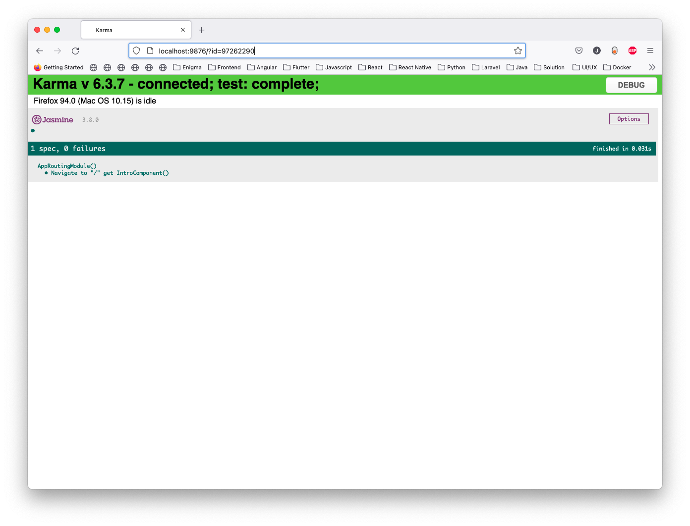
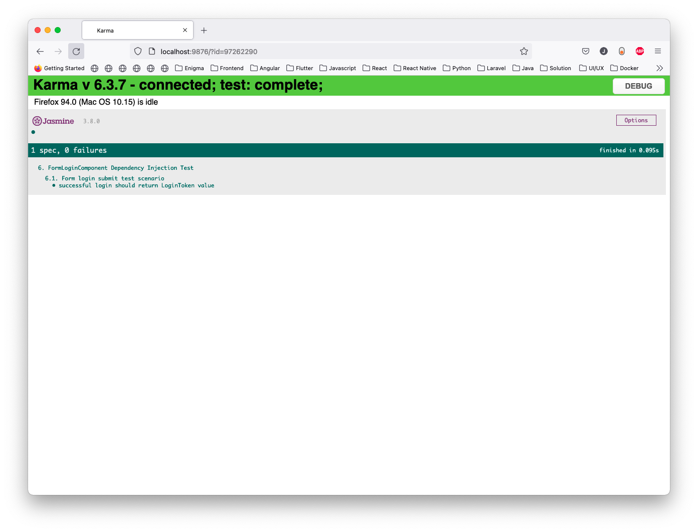
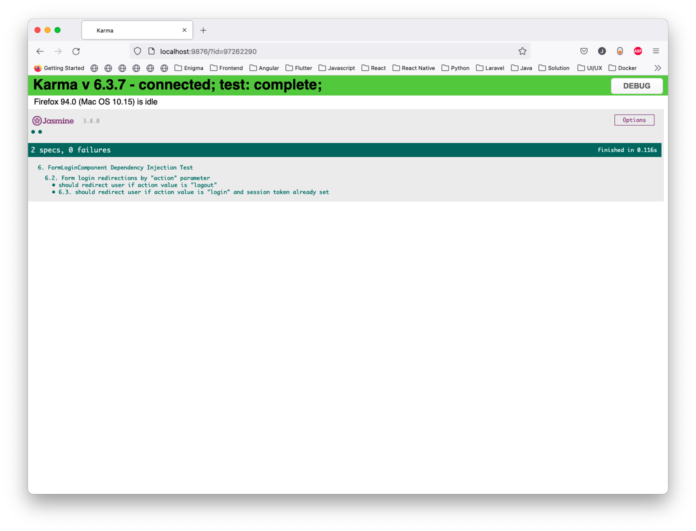
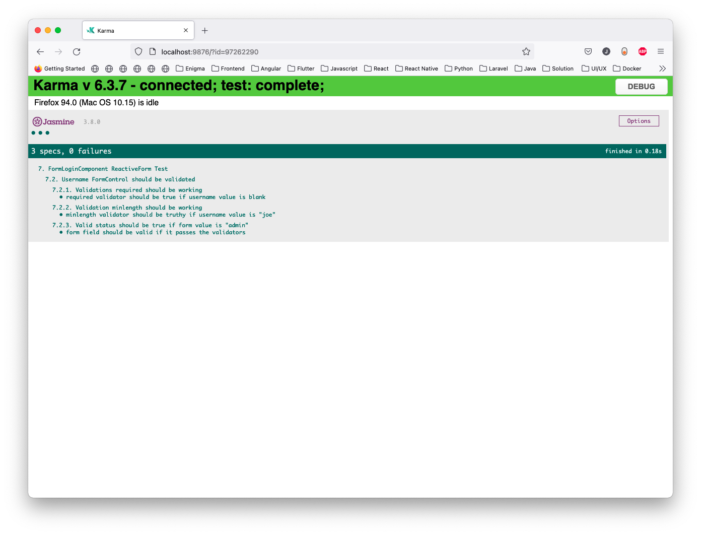
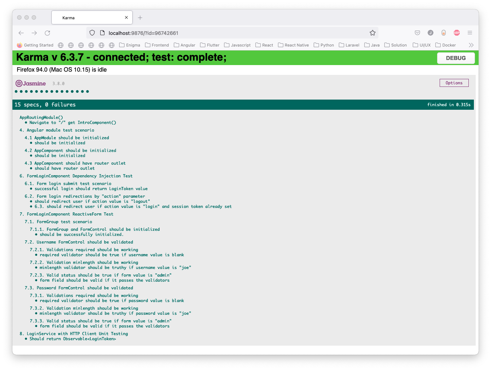

# Angular Unit Testing - Part 2

---

#### 1. Unit Testing `App Routing Module`

Pengujian App Routing Module bertujuan untuk menguji fungsionalitas routing pada aplikasi.

Mulailah dengan memnbuat sebuah file `src/app/app.routing.module.spec.ts` dan tulis kode dibawah ini kedalam file yang
sudah dibuat.

```typescript
import { Router } from '@angular/router';
import { fakeAsync, TestBed } from '@angular/core/testing';
import { RouterTestingModule } from '@angular/router/testing';
import { Location } from '@angular/common';

describe('AppRoutingModule()', () => {

  let location: Location;
  let router: Router;

  beforeEach(() => {
    TestBed.configureTestingModule({
      imports: [
        RouterTestingModule.withRoutes([])
      ]
    })

    router = TestBed.inject(Router);
    location = TestBed.inject(Location);
    router.initialNavigation();
  })

  it('Navigate to "/" get IntroComponent()', fakeAsync(() => {
    router.navigate(["/"]).then(() => {
      expect(location.path()).toBe("/");
    })
  }))
})
```



#### Penjelasan
1. `location.path` merupakan salah satu fungsi untuk mendapatkan path saat ini.
2. `router.navigate` merupakan salah satu fungsi dari router untuk mengarahkan sesuai url yang di masukan kedalam parameter.
---
#### 2. Unit Testing `Form Login`

Pengujian Form Login Component ditujukan untuk memastikan bahwa component `Form Login`
berjalan dengan sesuai yang di inginkan


Mulailah dengan membuat file `src/app/login/component/form-login.component.spec.ts` dan tulislah kode dibawah ini

```typescript
import { Location } from '@angular/common';
import { HttpClientTestingModule } from '@angular/common/http/testing';
import { ComponentFixture, TestBed } from '@angular/core/testing';
import { AbstractControl, FormsModule, ReactiveFormsModule, ValidationErrors } from '@angular/forms';
import { ActivatedRoute, Router } from '@angular/router';
import { RouterTestingModule } from '@angular/router/testing';
import { Observable, of } from 'rxjs';
import { Login, LoginToken } from '../model/login';
import { LoginService } from '../service/login.service';
import { FormLoginComponent } from './form-login.component';

describe('6. FormLoginComponent Dependency Injection Test', () => {

  let fixture: ComponentFixture<FormLoginComponent>;
  let component: FormLoginComponent;
  let loginService: jasmine.SpyObj<LoginService>;
  let activatedRoute: ActivatedRoute;
  let router: Router;
  let location: Location;

  beforeEach(() => {
    const loginServiceSpy = jasmine.createSpyObj('LoginService', ['login']);

    TestBed.configureTestingModule({
      declarations: [FormLoginComponent],
      imports: [FormsModule, ReactiveFormsModule, HttpClientTestingModule, RouterTestingModule.withRoutes([])],
      providers: [
        {provide: LoginService, useValue: loginServiceSpy}
      ]
    });

    fixture = TestBed.createComponent(FormLoginComponent);
    component = fixture.componentInstance;
    loginService = TestBed.inject(LoginService) as jasmine.SpyObj<LoginService>;
    activatedRoute = TestBed.inject(ActivatedRoute);
    router = TestBed.inject(Router);
    location = TestBed.inject(Location);


    fixture.detectChanges();
  });

  afterEach(() => {
    sessionStorage.removeItem('token');
  });
})
```

### Penjelasan
1. `afterEach` sebuah salah satu fungsi dari Jasmine, untuk menghilangkan duplicated setup atau kode setelah selesai melakukan unit test
2. `ComponentFixture` sebuah API dari angular/core untuk melakukan testing dan debugging component.
3. `activatedRoute` sebuah API dari angular untuk menyediakan akses informasi tentang route yang terkait dengan komponent yang dimuat.
4. `jasmine.createSpyObj` sebuah fungsi dari jasmine untuk membuat service dummy.
5. `fixture.detectChanges` sebuah fungsi dari jasmine untuk mendeteksi apakah ada perubahan pada komponent yang dimuat.

---

### Test Scenario `FormLogin` Component

1. Test scenario pertama berupa pengujian apakah FormLogin berhasil membalikan LoginToken ketika submit username dan password.

```typescript
describe('6.1. Form login submit test scenario', () => {
    it('successful login should return LoginToken value', async () => {
      const stubLoginToken: LoginToken = { token: 'thisIsJustAStubbedTokenValue' };

      loginService.login.and.returnValue(of(stubLoginToken));
      component.form.setValue({ username: 'demo', password: 'demo' });

      component.onFormSubmit();

      const loginToken: LoginToken = await loginService.login.calls.mostRecent().returnValue.toPromise();

      expect(loginService.login.calls.count()).toBe(1);
      expect(loginToken).toEqual(stubLoginToken);
    });
  });
```



2. Test scenario ketika user dengan parameter `logout`.
3. Test scenario mengarahkan kesebuah halaman ketika user dengan parameter `login` dan `session token` sudah diset.

```typescript
describe('6.2. Form login redirections by "action" parameter', () => {
  it('should redirect user if action value is "logout"', async () => {
    const action = 'logout';
    const spy = spyOn(activatedRoute.params, 'pipe')
        .and.callThrough()
        .and.callFake(() => of(action) as Observable<any>);

    component.ngOnInit();
    fixture.detectChanges();

    const actualAction = await spy.calls.mostRecent().returnValue.toPromise();

    expect(spy).toHaveBeenCalled();
    expect(spy.calls.count()).toBe(1);
    expect(actualAction).toEqual(action);
    expect(sessionStorage.getItem('token')).toBeFalsy();
    expect(location.path()).toMatch('/');
  });

  it('6.3. should redirect user if action value is "login" and session token already set', async () => {
    const action = 'login';
    const spy = spyOn(activatedRoute.params, 'pipe')
        .and.callThrough()
        .and.callFake(() => of(action) as Observable<any>);

    sessionStorage.setItem('token', 'thisIsJustAStubbedTokenValue');
    component.ngOnInit();
    fixture.detectChanges();

    const actualAction = await spy.calls.mostRecent().returnValue.toPromise();

    expect(spy).toHaveBeenCalled();
    expect(spy.calls.count()).toBe(1);
    expect(actualAction).toEqual(action);
    expect(sessionStorage.getItem('token')).toBeTruthy();
    expect(location.path()).toMatch('/');
  });
})
```



4. Unit Testing `FormLoginComponent` Reactive Form

Pengujian `FormLoginComponent` Reactive Form ditujukan untuk memastikan bahwa form berhasil dibuat.

```typescript
describe('7. FormLoginComponent ReactiveForm Test', () => {
  let fixture: ComponentFixture<FormLoginComponent>;
  let component: FormLoginComponent;
  let loginService: jasmine.SpyObj<LoginService>;
  let location: Location;

  beforeEach(() => {
    const loginServiceSpy = jasmine.createSpyObj('LoginService', ['login']);

    TestBed.configureTestingModule({
      declarations: [FormLoginComponent],
      imports: [FormsModule, ReactiveFormsModule, HttpClientTestingModule, RouterTestingModule.withRoutes([])],
      providers: [
        {provide: LoginService, useValue: loginServiceSpy}
      ],
    });

    fixture = TestBed.createComponent(FormLoginComponent);
    component = fixture.componentInstance;
    loginService = TestBed.inject(LoginService) as jasmine.SpyObj<LoginService>;
    location = TestBed.inject(Location);
  });

  describe('7.1. FormGroup test scenario', () => {

    describe('7.1.1. FormGroup and FormControl should be initialized', () => {
      it('should be successfully initialized.', () => {
        expect(component.form).toBeTruthy();

        expect(component.form.get('username')).toBeDefined();
        expect(component.form.get('username')).toBeInstanceOf(AbstractControl);

        expect(component.form.get('password')).toBeDefined();
        expect(component.form.get('password')).toBeInstanceOf(AbstractControl);
      });
    });
  });
});
```


---
#### Test Scenario Form Username

1. Test Scenario ketika Form username di isi dengan value blank atau kosong, form Validator akan aktif.
2. Test Scenario ketika Form username di isi dengan value `joe` dan tidak memenuhi minimun panjang form username, form validator akan aktif.
3. Test Scenario ketika Form username di isi dengan value `admin`, form Validator akan aktif dan mengembalikan value true yang berarti value tersebut `Valid`.
```typescript
describe('7.2. Username FormControl should be validated', () => {
    let usernameControl: AbstractControl;

    beforeEach(() => {
      usernameControl = component.form.get('username') as AbstractControl;
    });

    describe('7.2.1. Validations required should be working', () => {
      it('required validator should be true if username value is blank', () => {
        usernameControl.setValue('');
        usernameControl.markAsTouched();
        fixture.detectChanges();

        const errors = usernameControl.errors as ValidationErrors;

        expect(errors).toBeTruthy();
        expect(errors['required']).toBeTruthy();
        expect(usernameControl.invalid).toBeTrue();
        expect(component.isFieldValid('username')).toMatch('is-invalid');
      });
    });

    describe('7.2.2. Validation minlength should be working', () => {
      it('minlength validator should be truthy if username value is "joe"', () => {
        usernameControl.setValue('joe');
        usernameControl.markAsTouched();
        fixture.detectChanges();

        const errors = usernameControl.errors as ValidationErrors;

        expect(errors).toBeTruthy();
        expect(errors['minlength']).toBeTruthy();
        expect(usernameControl.invalid).toBeTrue();
        expect(component.isFieldValid('username')).toMatch('is-invalid');
      });
    });

    describe('7.2.3. Valid status should be true if form value is "admin"', () => {
      it('form field should be valid if it passes the validators', () => {
        usernameControl.setValue('admin');
        usernameControl.markAsTouched();
        fixture.detectChanges();

        expect(component.form.get('username')?.valid).toBeTrue();
        expect(component.form.get('username')?.value).toMatch('admin');
        expect(component.isFieldValid('username')).toMatch('is-valid');
      });
    });
  });
```



---

#### Test Scenario Form Password

1. Test Scenario ketika Form password di isi dengan value blank atau kosong, form Validator akan aktif.
2. Test Scenario ketika Form password di isi dengan value `joe` dan tidak memenuhi minimun panjang form password, form Validator akan aktif.
3. Test Scenario ketika Form password di isi dengan value `admin`, form Validator akan aktif dan mengembalikan value true yang berarti value tersebut `Valid`.

```typescript
describe('7.3. Password FormControl should be validated', () => {
    let passwordControl: AbstractControl;

    beforeEach(() => {
      passwordControl = component.form.get('password') as AbstractControl;
    });

    describe('7.3.1. Validations required should be working', () => {
      it('required validator should be true if password value is blank', () => {
        passwordControl.setValue('');
        passwordControl.markAsTouched();
        fixture.detectChanges();

        const errors = passwordControl.errors as ValidationErrors;

        expect(errors).toBeTruthy();
        expect(errors['required']).toBeTrue();
        expect(passwordControl.invalid).toBeTrue();
        expect(component.isFieldValid('password')).toMatch('is-invalid');
      });
    });

    describe('7.3.2. Validation minlength should be working', () => {
      it('minlength validator should be truthy if password value is "joe"', () => {
        passwordControl.setValue('joe');
        passwordControl.markAsTouched();
        fixture.detectChanges();

        const errors = passwordControl.errors as ValidationErrors;

        expect(errors).toBeTruthy();
        expect(errors['minlength']).toBeTruthy();
        expect(passwordControl.invalid).toBeTrue();
        expect(component.isFieldValid('password')).toMatch('is-invalid');
      });
    });

    describe('7.3.3. Valid status should be true if form value is "admin"', () => {
      it('form field should be valid if it passes the validators', () => {
        passwordControl.setValue('admin');
        passwordControl.markAsTouched();
        fixture.detectChanges();

        expect(component.form.get('password')?.valid).toBeTrue();
        expect(component.form.get('password')?.value).toMatch('admin');
        expect(component.isFieldValid('password')).toMatch('is-valid');
      });
    });
  });
```


### Output Keseluruhan




---
[Kembali](../README.md)
