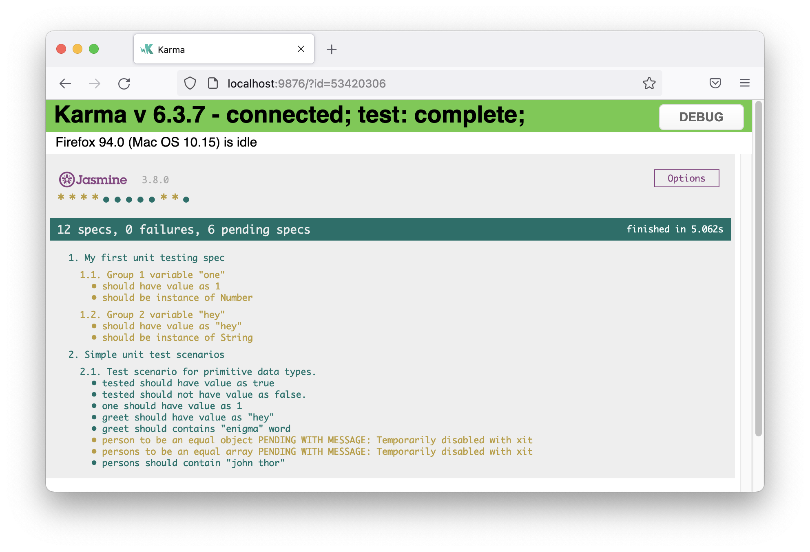
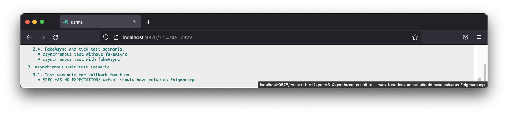

# Pengenalan Unit Testing

## Sebelum Memulai

Buka file [`./src/test.ts`](./src/test.ts) di dalam folder src project ini, lalu ubah code pada line **25** menjadi seperti berikut.

```typescript
// This file is required by karma.conf.js and loads recursively all the .spec and framework files

import 'zone.js/testing';
import { getTestBed } from '@angular/core/testing';
import {
  BrowserDynamicTestingModule,
  platformBrowserDynamicTesting
} from '@angular/platform-browser-dynamic/testing';

declare const require: {
  context(path: string, deep?: boolean, filter?: RegExp): {
    keys(): string[];
    <T>(id: string): T;
  };
};

// First, initialize the Angular testing environment.
getTestBed().initTestEnvironment(
  BrowserDynamicTestingModule,
  platformBrowserDynamicTesting(),
  { teardown: { destroyAfterEach: true }},
);

// Sesuaikan code di bawah ini, ./ menjadi ./test
const context = require.context('./test', true, /\.spec\.ts$/);

// And load the modules.
context.keys().map(context);
```

## Materi

### 1. Pengenalan Unit Testing Suite Library Jasmine

Pada bagian ini kita akan membahas mengenai unit testing library yang digunakan di project Angular.

#### 1.1. Pengenalan Fungsi Testing Umum Pada Jasmine

#### 1.1.1. Fungsi `describe`

- **Describe** merupakan deskripsi dari spec unit testing.
- **Describe** dapat juga berfungsi sebagai group dari spec yang memiliki keterkaitan satu sama lain.
- **Describe** dapat nested, terdapat `describe` di dalam `describe`.
- **Describe** dapat di skip dengan menambahkan awalan `x`, contoh `xdescribe`.

Buatlah file `1-intro.spec.ts` di dalam folder `src/_test`, lalu copy/paste code berikut.

```typescript
describe('1. My first unit testing spec', () => {
  // unit testing specs
});
```

Lanjutkan dengan copy/paste code berikut.

```typescript
describe('1. My first unit testing spec', () => {
  // unit testing specs
  
  describe('1.1. Group 1', () => {
    // group spec 1
  });
  
  describe('1.2. Group 2', () => {
    // group spec 2
  });
});
```

#### 1.1.2. Fungsi `it`

- **It** merupakan **test scenario** project kita yang terdiri dari **sejumlah test cases**.
- **It** tidak bisa dipanggil di luar `describe`.
- **It** dapat di skip dengan menambahkan awalan `x`, contoh `xit`.
- Di dalam 1 `describe` dapat memiliki banyak `it`.

Di dalam file `1-intro.spec.ts`, tambahkan code berikut.

```typescript
describe('1. My first unit testing spec', () => {
  // unit testing specs

  describe('1.1. Group 1 variable "one"', () => {
    // group spec 1
    const one: Number = Number(1);

    it('should have value as 1', () => {
      // test cases written within it
    });

    it('should be instance of Number', () => {
      // test cases written within it
    });
  });

  describe('1.2. Group 2', () => {
    // group spec 2
    const greet: String = String('hey');

    it('should have value as "hey"', () => {
      // test cases written here
    });

    it('should be instance of String', () => {
      // test cases written here
    });
  });
});
```

**Group 1** terdiri dari 2 **test scenario**, yaitu
1. Apakah variable one bernilai 1? 
2. Apakah variable one instance of Number?

**Group 2** terdiri dari 2 **test scenario**, yaitu
1. Apakah variable greet bernilai 'hey'?
2. Apakah variable greet instance of String?

#### 1.1.3. Fungsi `expect`

- **Expect** merupakan test case dari suatu test scenario.
- **Expect** hanya bisa terdapat di dalam fungsi `it` (test scenario).
- Di dalam suatu `it` boleh memiliki banyak `expect` sebagai test cases-nya.
- Sebuah fungsi `expect` dapat dilanjutkan dengan fungsi `matchers` seperti `toBe`, `toEqual`, `toBeInstanceOf`, dll.
- Referensi terkait jenis-jenis `matchers` dapat dilihat [di sini](https://jasmine.github.io/api/edge/matchers.html).

Lanjutkan dengan menambahkan code berikut di dalam file `intro.spec.ts`.

```typescript
describe('1. My first unit testing spec', () => {
  // unit testing specs

  describe('1.1 Group 1 variable "one"', () => {
    // group spec 1
    const one: Number = Number(1);

    // test scenario
    it('should have value as 1', () => {
      // test case
      expect(one).toEqual(1);
    });

    // test scenario
    it('should be instance of Number', () => {
      // test case
      expect(one).toBeInstanceOf(Number);
    });
  });

  describe('1.2. Group 2 variable "greet"', () => {
    // group spec 2
    const greet: String = String('hey');

    // test scenario
    it('should have value as "hey"', () => {
      // test case
      expect(greet).toEqual('hey');
    });

    // test scenario
    it('should be instance of String', () => {
      // test case
      expect(hey).toBeInstanceOf(String);
    });
  });
});
```

#### 1.1.4 Fungsi `beforeEach` dan `beforeAll`

- Fungsi `beforeEach`
  - Dipanggil sebelum setiap test case berjalan.
  - Digunakan untuk mempersiapkan kondisi yang dibutuhkan setiap kali test case berjalan.
  - Fungsi `beforeEach` cukup didefinisikan sekali saja, dan akan dieksekusi setiap kali test case berjalan.

- Fungsi `beforeAll`
  - Dipanggil sekali sebelum semua test case berjalan.
  - Digunakan untuk mempersiapkan kondisi yang dapat dipenuhi sekali saja untuk semua test case.

Contoh penggunaan fungsi `beforeEach` dan `beforeAll` akan dibahas pada bagian pengujian Angular component.

#### 1.1.5 Fungsi `afterEach` dan `afterAll`

- Fungsi `afterEach`
    - Dipanggil setelah setiap test case berjalan.
    - Biasanya digunakan sebagai garbage collector, untuk membersihkan sisa-sisa test case sebelumnya yang sudah tidak terpakai sebelum test case berikutnya berjalan.
    - Fungsi `afterEach` cukup didefinisikan sekali saja, dan akan dieksekusi setiap kali test case selesai berjalan.

- Fungsi `afterAll`
    - Dipanggil sekali setelah semua test case berjalan.
    - Biasanya digunakan sebagai garbage collector, untuk membersihkan sisa-sisa test case setelah semuanya berjalan.

Contoh penggunaan fungsi `afterEach` dan `afterAll` akan dibahas pada bagian pengujian Angular.

#### 1.1.6 Menjalankan Unit Testing

Jalankan `unit testing` ini dengan cara berikut.

```shell
$ npm test
```

Lalu perhatikan output dari unit testing di browser yang terbuka.


#### 1.2. Unit Testing Matchers

Pada bagian ini kita akan mencoba menerapkan `matchers` yang disediakan oleh [Jasmine](https://jasmine.github.io/api/edge/matchers.html).

Buatlah file baru `2-simple-test.spec.ts` di dalam folder `src/_test`, lalu copy/paste code berikut.

```typescript
describe('2. Simple unit test scenarios', () => {
  describe('2.1. Test scenario for primitive data types.', () => {
    const one = 1;
    const greet = 'hey';
    const tested = true;
    const person = { firstName: 'John', lastName: 'Thor' };
    const persons = [ 'john thor', 'moon young' ];
    
  });

  describe('2.2. Truthy and falsy value test scenario', () => {
    const truth = true;
    const lie = false;
    const zero = 0;
    const one = 1;
    const blank = '';
    const filled = 'filled';
    const nullValue = null;
    let notDefined: any;
    
  });
});
```

#### 1.2.1. Matchers Sederhana

Matchers sederhana biasanya digunakan untuk menguji data primitif seperti:
- boolean
- number
- string
- null
- undefined

Tambahkan code berikut di dalam test spec group **2.1. Test scenario for primitive data types.**

```typescript
describe('2. Simple unit test scenarios', () => {
  describe('2.1. Test scenario for primitive data types.', () => {
    const one = 1;
    const greet = 'hey';
    const tested = true;
    const person = { firstName: 'John', lastName: 'Thor' };
    const persons = [ 'john thor', 'moon young' ];

    it('tested should have value as true', () => {
      expect(tested).toBe(true);
    });

    it('tested should not have value as false.', () => {
      expect(tested).not.toBe(false);
    });

    it('one should have value as 1', () => {
      expect(one).toBe(1);
    });

    it('greet should have value as "hey"', () => {
      expect(greet).toBe('hey');
    });

    it('greet should contains "enigma" word', () => {
      const actual: string = `${greet}, welcome to Enigma Camp!`;

      expect(actual).toMatch(/Enigma Camp/);
      expect(actual).toMatch('Enigma Camp')
    });

    // test case di bawah ini akan gagal, hapus tanda x pada xit untuk menjalankan test case.
    xit('person to be an equal object', () => {
      expect(person).toBe({ firstName: 'John', lastName: 'Thor' });
    });

    // test case di bawah ini akan gagal, hapus tanda x pada xit untuk menjalankan test case.
    xit('persons to be an equal array', () => {
      expect(persons).toBe([ 'john thor', 'moon young' ]);
    });

    it('persons should contain "john thor"', () => {
      expect(persons).toContain('john thor');
    });
  });

  describe('2.2. Truthy and falsy value test scenario', () => {});
});
```

##### Output



#### 1.2.2. Matchers Truthy Dan Falsy

Pengujian nilai `truthy` dan `falsy` digunakan untuk menguji nilai suatu variable didalam suatu kondisi, misalnya

```typescript
const person1 = null;
const person2 = 'nobody';

if (!person1) {
  console.log('There is no person.');
}

if (person2) {
  console.log('Nobody still a person.');
}
```

Tambahkan code berikut di dalam test spec group **2.2. Truthy and falsy value test scenario.**

```typescript
describe('2. Simple unit test scenarios', () => {
  describe('2.1. Test scenario for primitive data types.', () => {
  });

  describe('2.2. Truthy and falsy value test scenario', () => {
    const truth = true;
    const lie = false;
    const zero = 0;
    const one = 1;
    const blank = '';
    const filled = 'filled';
    const nullValue = null;
    let notDefined: any;

    it('truthy variables should passed the test', () => {
      expect(truth).toBeTruthy();
      expect(one).toBeTruthy();
      expect(filled).toBeTruthy();
    });

    it('falsy variables should passed the test', () => {
      expect(lie).toBeFalsy();
      expect(zero).toBeFalsy();
      expect(blank).toBeFalsy();
      expect(nullValue).toBeFalsy();
      expect(notDefined).toBeFalsy();
    });

    it('truth should have value as boolean true', () => {
      expect(truth).toBeTrue();
      expect(truth).toBeTruthy();

      expect(one).toBeTrue();
    });

    it('lie should have value as boolean false', () => {
      expect(lie).toBeFalse();
      expect(lie).toBeFalsy();

      expect(zero).toBeFalse();
    });
  });
});
```

##### Output


#### 1.2.3 Matchers Untuk Menguji Object Dan Array

Untuk menguji variabel dengan tipe `object` maupun `array`, kita bisa menggunakan beberapa matchers berikut:

- `toEqual`
- `toBeInstanceOf`

Masih pada file `2-simple.spec.ts`, tambahkan test scenario baru seperti berikut.

```typescript
describe('2. Simple unit test scenarios', () => {
  describe('2.1. Test scenario for primitive data types.', () => {});

  describe('2.2. Truthy and falsy value test scenario', () => {});

  describe('2.3. Object and array value test scenario.', () => {
    const actualPerson: Person = new Person('John', 'Thor');
    const expectedPerson: Person = new Person('John', 'Thor');
    const persons: Person[] = [
      new Person('John', 'Thor'),
      new Person('Moon', 'Young'),
    ];

    it('actualPerson should be EQUAL to expectedPerson and instance of Person', () => {
      // expect(actualPerson).toBe(expectedPerson);
      expect(actualPerson).toEqual(expectedPerson);
      expect(actualPerson).toBeInstanceOf(Person);
    });

    it('persons should be array of Person', () => {
      for (const person of persons) {
        expect(person).toBeInstanceOf(Person);
      }
    });

    // test scenario generic object akan gagal pada salah satu test case.
    xit ('newly added person object to persons should be as equal to person object', () => {
      const newPerson: Person = { firstName: 'Moon', lastName: 'Thor' };

      expect(newPerson).toEqual({ firstName: 'Moon', lastName: 'Thor' });
      expect(newPerson).toBeInstanceOf(Person);
    });

    // test scenario berikut akan gagal.
    xit ('newly added person to persons should be instance of Person', () => {
      const newPerson: Person = { firstName: 'Moon', lastName: 'Thor' };
      persons.push(newPerson);

      for (const person of persons) {
        expect(person).toBeInstanceOf(Person);
      }
    });

    // test scenario empty Person akan gagal pada salah satu test case.
    xit('empty Person should be truthy', () => {
      const empty: Person = new Person();

      expect(empty).toBeTruthy();
      expect(empty).toBeFalsy();
    });
  });
});
```

##### Catatan!
- `Generic Object` tidak sama dengan `Class Object`, meski memiliki property yang sama. 
- Class yang semua properies-nya `undefined`, tidak dianggap `falsy`.


#### 1.3. Unit Test Scenario `fakeAsync` Dan `tick`

Pada skenario tertentu, javascript dapat memiliki blok kode yang berjalan secara `asynchronous`, pengujian dapat dijalankan di dalam scenario `fakeAsync` dan `tick`.

- `fakeAsync` merupakan fungsi test scenario yang dapat menunggu proses `asynchronous` yang berjalan.
- `tick` merupakan fungsi untuk menunggu atau dapat dikatakan `sleep` selama periode waktu tertentu dalam satuan `milliseconds`.

```typescript

describe('2. Simple unit test scenarios', () => {
  describe('2.1. Test scenario for primitive data types.', () => {});

  describe('2.2. Truthy and falsy value test scenario', () => {});

  describe('2.3. Object and array value test scenario.', () => {});
  
  describe('2.4. FakeAsync and tick test scenario.', () => {
    it('asynchronous test without fakeAsync', (done) => {
      let test: boolean = false;
      setTimeout(() => {
        test = true;
        expect(test).toBeTrue();
        done()
      }, 1000);

      // expect(test).toBeTrue();
    });

    it('asynchronous test with fakeAsync', fakeAsync(() => {
      let test: boolean = false;
      setTimeout(() => {
        test = true;
        expect(test).toBeTrue();
      }, 1000);

      expect(test).toBeFalse();

      tick(500);
      expect(test).toBeFalse();

      tick(500);
      expect(test).toBeTrue();
    }));
  });
});
```


#### 1.4. Unit Test Scenario Untuk Menguji Fungsi Asynchronous

Pada bagian ini kita akan pengujian berbagai fungsi yang bersifat `asynchronous` pada javascript, seperti:

1. Fungsi dengan parameter `callback function`.
2. Fungsi yang mengembalikan `Promise`.
3. Fungsi yang mengembalikan `Observable`.

Seperti yang sudah dibahas pada bagian **1.3** sebelumnya, kita harus memanggil fungsi `done` untuk menyelesaikan proses pengujian.
Buatlah file baru dengan nama `3-async.spec.ts` pada folder `src/_test`, dan tambahkan kode berikut.

```typescript
function fetchCallback(cb: (data: string) => void): void {
  setTimeout(() => {
    cb('Enigmacamp');
  }, 1000);
}

function fetchPromise(): Promise<string> {
  return new Promise((resolve, reject) => {
    fetchCallback(resolve);
  });
}

function fetchObservable(): Observable<string> {
  return from(fetchPromise());
}

describe('3. Asynchronous unit test scenario', () => {
  const expected = 'Enigmacamp';
  
  // TODO: Test scenarios
});
```

#### 1.4.1 Pengujian fungsi `fetchCallback`

Untuk menguji fungsi `fetchCallback` dapat dilakukan dengan menambahkan kode berikut.

```typescript
/** baris kode sebelumnya tidak ditulis pada bagian ini */
describe('3. Asynchronous unit test scenario', () => {

  const expected = 'Enigmacamp';

  describe('3.1. Test scenario for callback functions', () => {
    // SPEC HAS NO EXPECTATIONS
    it(`actual should have value as ${expected}`, () => {
      fetchCallback((actual) => {
        expect(actual).toMatch(expected);
      });
    });
  });
});
```

> Jika tidak memanggil fungsi `done` maka akan memunculkan output **SPEC HAS NO EXPECTATIONS**

##### Perhatikan output berikut



Untuk mengatasi permasalahan tersebut gunakan fungsi `done` seperti pada contoh berikut.

```typescript
/** baris kode sebelumnya tidak ditulis pada bagian ini */
describe('3. Asynchronous unit test scenario', () => {

  const expected = 'Enigmacamp';

  describe('3.1. Test scenario for callback functions', () => {
    // SPEC HAS NO EXPECTATION
    it(`actual should have value as ${expected}`, (done) => {
      fetchCallback((actual) => {
        expect(actual).toMatch(expected);
        done(); // fungsi done akan menyelesaikan pengujan jika actual sesuai dengan expected
      });
    });
  });
});
```

#### 1.4.2 Pengujian fungsi `fetchPromise`

Pengujian fungsi yang mengembalikan `Promise` dapat dilakukan dengan beberapa cara, yaitu:

1. Dengan me-`return` memanggil fungsi `done` sama seperti pada bagian sebelumnya.
2. Dengan menggunakan fungsi `async` yang akan `await` fungsi tersebut.

Untuk menguji fungsi `fetchPromise` dapat dilakukan dengan menambahkan kode berikut.

```typescript
/** baris kode sebelumnya tidak ditulis pada bagian ini */
describe('3. Asynchronous unit test scenario', () => {

  const expected = 'Enigmacamp';

  /** describe 3.1. Test scenario for callback functions tidak ditulis pada bagian ini */
  
  describe('3.2. Test scenario for promise functions', () => {
    it(`promised actual should have value as ${expected}`, (done) => {
      fetchPromise().then((actual) => {
        expect(actual).toMatch(expected);
        done();
      });
    });

    it(`promised actual should have value as ${expected} with async function`, async () => {
      const actual = await fetchPromise();
      expect(actual).toMatch(expected);
    });
  });
});
```

##### Perhatikan output berikut


#### 1.4.3 Pengujian fungsi `fetchObservable`

Pengujian fungsi yang mengembalikan sebuah `Observable` tidak berbeda dengan cara pengujian fungsi yang mengembalikan `Promise`, seperti pada contoh berikut.

```typescript
/** baris kode sebelumnya tidak ditulis pada bagian ini */
describe('3. Asynchronous unit test scenario', () => {

  const expected = 'Enigmacamp';

  /** describe '3.1. Test scenario for callback functions' tidak ditulis pada bagian ini */
  /** describe '3.2. Test scenario for promise functions' tidak ditulis pada bagian ini */

  describe('3.3. Test scenario for observable functions', () => {
    it(`subscribed actual should have value as ${expected}`, (done) => {
      fetchObservable().subscribe((actual) => {
        expect(actual).toMatch(expected);
        done();
      });
    });
    
    it(`subscribed actual should have value as ${expected} with async function`, async () => {
      const actual = await fetchObservable().toPromise();
      
      expect(actual).toMatch(expected);
    });
  });
});
```

##### Perhatikan output berikut


### 2. Output Keseluruhan


---
[Kembali](../README.md) | [Berikutnya](./unit-test-angular-1.md)
